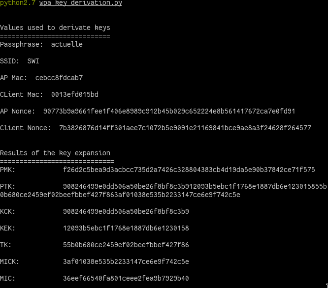
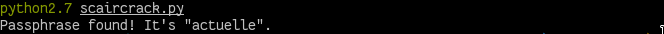

# Wireless Networks and Security

## Names
Pierre Kohler, Pierrick Muller, Kim Wonkyeong
=======

## WPA Security

__Korean/Swiss hybrid teams are highly encouraged__

### For this first part, you will need to:

* From a Wireshark pcap file, using Scapy, manually extract the necessary elements in order to derive the encryption and integrity keys
* Using Python and Scapy, code your own version of the cracking tool ```aircrack```, a brute-forcing tool that finds a WPA network passphrase from a 4-way handshake


You will need Scapy but __not__ the Alfa interfaces this time. Please refer to the [MAC Security Lab](https://github.com/arubinst/SU19-WLANSec-Lab1-MAC) for important information about Monitor Mode, Python, Scapy, WiFi interfaces, etc.


## Your Work

### 1. Obtain parameters for the derivation of WPA keys  


In this first part, you will recover the the Python script [wpa\_key\_derivation.py](./files/wpa_key_derivation.py). 

You will also need the capture file [wpa\_handshake.cap](./files/wpa_handshake.cap) containing a WPA authentication. You will also need the file [pbkdf2\_math.py](./files/pbkdf2_math.py), which allows to calculate the 4096 rounds for the passphrase hash. All these files need to be copied to the same folder in your local machine.

- Open the capture file [wpa\_key\_derivation.py](./files/wpa_key_derivation.py) using Wireshark
- Execute the script using ```python wpa_key_derivation.py```
- Try to identify the values shown by the script in the Wireshark capture
- Analyse the script. In particular, __pay attention__ to the variable ```data``` containing the payload of the frame. Compare this data to the payload of the 4th frame of the handshake (hint: the last bytes are different!). Read [Important info](#important-info) for an explanation.
- __Modify the script__ sot that it obtains directly from the ```pcap``` all the values that are currently hardcoded (```ssid```, ```APmac```, ```Clientmac```, nonces…)
- __ATTENTION__: some of the parameters cannot be easily obtained (for example the nonces). You will need to extract them from the raw data of the frame. This is how you access the raw data payload: ```frame.load```


### 2. Scaircrack (aircrack-ng based on Scapy)

```aircrack-ng``` uses the 4th message of the 4-way handshake to test the passphrases using a dictionary. This message does note contain any encrypted data, but it is authenticated using a MIC that can be uses as an "oracle" to test the different keys derived from the passphrases in the dictionary.


Using your previously created script as a starting point, create a new script ```scaircrack.py```. This new script should be able to:

- Read a passphrase from a dictionary file (wordlist)
- Derive the keys from this passphrase, nonces, etc., calculate the MIC on the last message of the 4-way handshake using Michael
- Recover the MIC contained within the last message of the 4-way handshake
- Compare both MICs
   - Identical &rarr; the passphrase you used is correct
   - Different &rarr; try a new passphrase


## Important info:

- The last message of the 4-way handshake contains a MIC in the payload. When you calculate your own MIC, you need to change the last bytes of the payload containing the MIC to ```\x00``` (read this part many times until you understand what it means... see the last message in Wireshark to help you understand)
- The calculation of the MIC in the authentication does not use Michael. It can use MD5 or SHA-1 and it is truncated to 16 bytes (32 digits/chars). The 4-way handshake contains the necessary information in the filed Key Information
- The command ```b2a_hex(variable)``` is equivalent to ```variable.encode("hex")``` - it returns a string with the hex representation of the binary data contained in ```variable```. Each byte in ```variable``` will be converted to its hex representation with two digits.  
- The command ```a2b_hex(variable)``` is equivalent to ```variable.decode("hex")``` - this function is the inverse of ```b2a_hex(variable)```


## Deliverables

Fork of the original repo. Then, a Pull Request containing :

- The names of the students. You can add this to the ```README.md```
- ```wpa_key_derivation.py``` script __modified__ for the automatic recovery of the parameters from the capture file. __Modifications must be extensively commented/documented__
   - Screen grab of your script in action
   
- ```scaircrack.py``` script __extensively commented/documented__ + the wordlist file
   - Screen grab of your script in action
   
